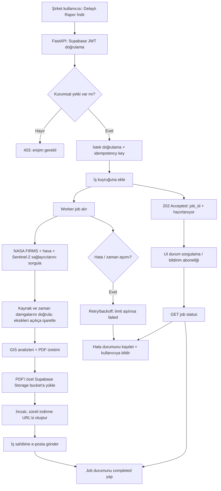

# Kurumsal rapor iş akışı — jüri diyagramı

Bu diyagram, repoya eklenen FastAPI worker API + Celery/Redis kuyruk tüketicisi + PDF üretimi + Supabase Storage signed URL + Resend e-posta akışını gösterir. Kodun repoda olması canlı dağıtımın yapıldığını göstermez; servisleri ayrı ayrı dağıtıp gerçek kimlik bilgileriyle kabul testinden geçirmek gerekir.

## Dağıtım kontrol listesi

- [ ] `NEXORA_WORKER_URL` ve yalnız sunucuda tutulan `NEXORA_WORKER_TOKEN`.
- [x] Repo içinde Celery + Redis kuyruk iskeleti ve worker API eklendi; Redis'in kalıcı/erişilebilir yapılandırması dağıtımda doğrulanmalı.
- [ ] Job tablosunda queued/running/completed/failed, progress, retry_count ve zaman damgaları.
- [ ] Her durum/indirme isteğinde işin sahibini doğrula; Storage bucket'ı private tut.
- [x] Kodda 7 günlük signed URL üretiliyor; bucket'ın private olduğuna ve URL erişiminin doğru çalıştığına dağıtımda bakılmalı.
- [ ] İdempotency ve tekrar deneme; çift PDF/e-posta üretimini engelle.
- [x] Resend e-posta gönderimi eklendi; doğrulanmış gönderen, rate limit ve teslimat logları dağıtımda ayarlanmalı.
- [ ] Şirket varlığı koordinatlarını loglara ve herkese açık artefaktlara yazma.
- [ ] Sağlayıcılar hata verirse rapor "veri yok/sağlayıcı hatası" yazsın; uydurma değer ekleme.
- [ ] 60–120 saniye hedefini ölçümle doğrula; garanti gibi sunma.
